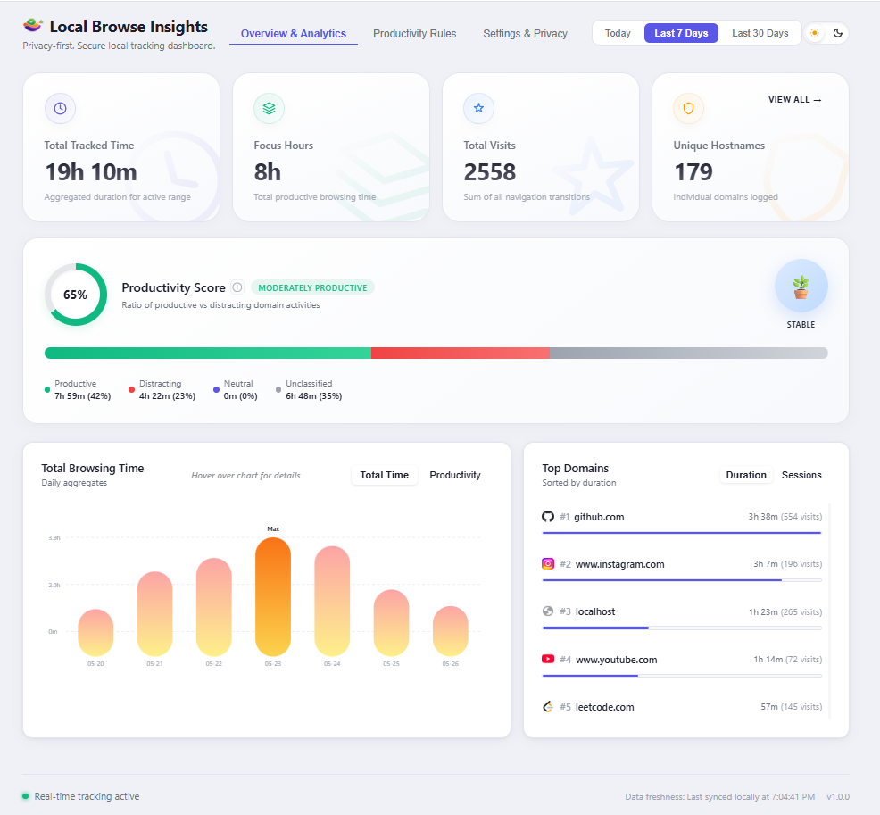
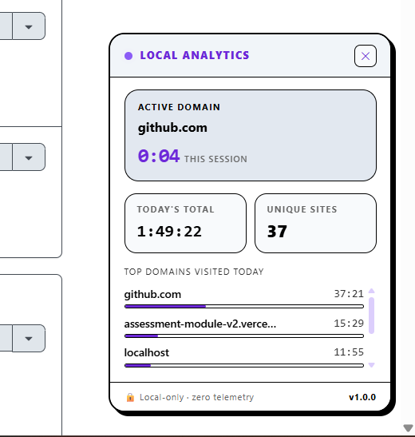
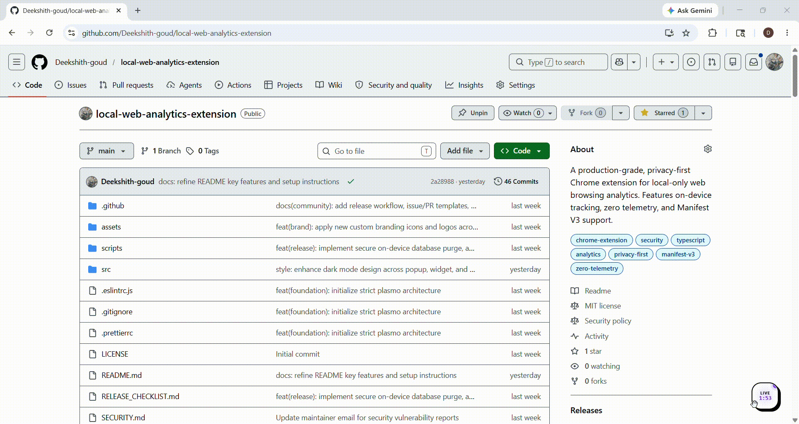
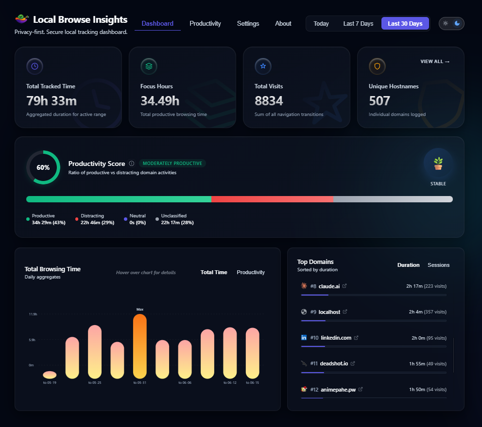
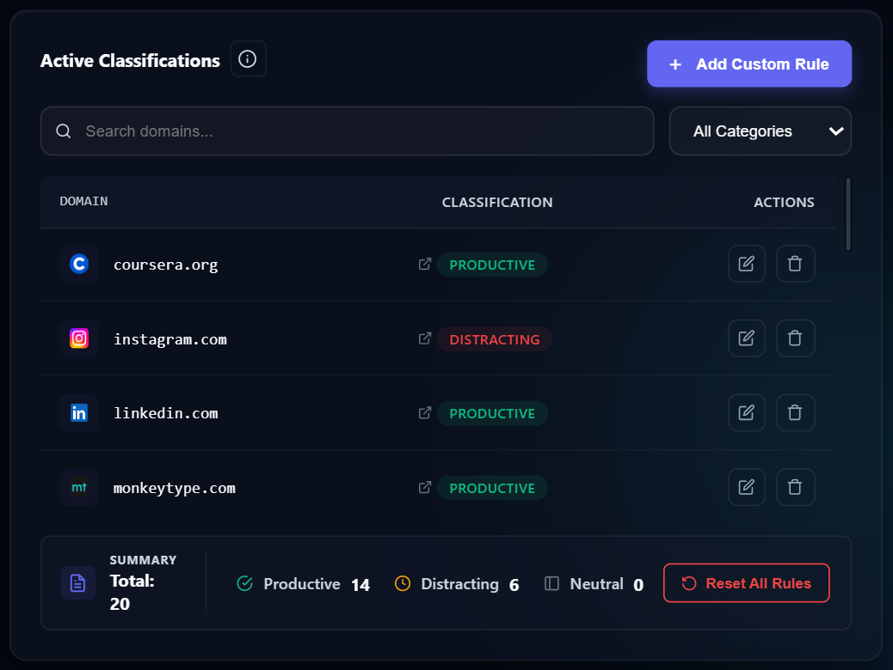
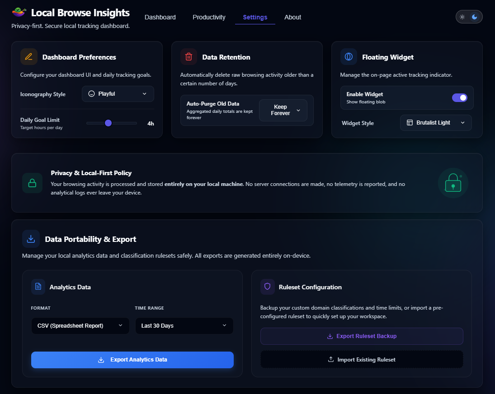
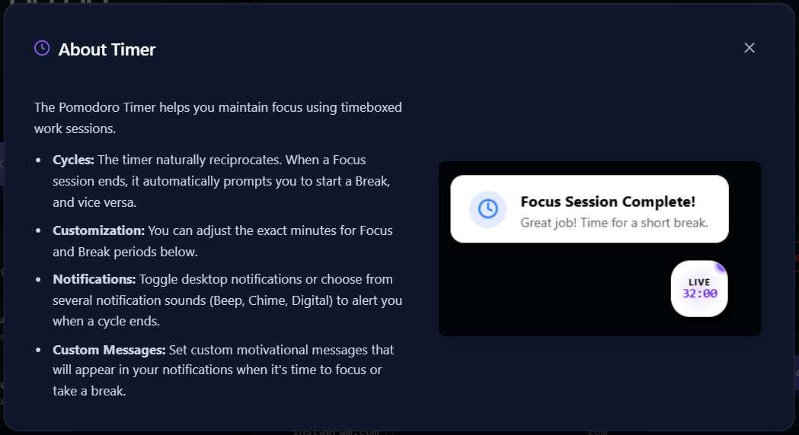
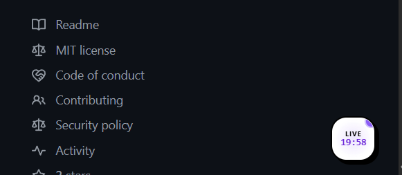

<div align="center">
  
</div>

<p align="center">
  <a href="https://reporanker.com/repos/Deekshith-goud/local-web-analytics-extension"></a>
  <a href="https://github.com/Deekshith-goud/local-web-analytics-extension/actions/workflows/main.yml"></a>
  <a href="LICENSE"></a>
  
</p>

Local Browse Insights is a browser extension that tracks your browsing activity, time usage, and productivity score entirely on-device. Built for developers and privacy-conscious users who want to analyze their web habits without sacrificing their personal data. Unlike typical analytics tools that send your browsing history to the cloud, everything in Local Browse Insights stays local—there is zero telemetry, zero external tracking, and no account required.

**Built With:** TypeScript, [Plasmo](https://docs.plasmo.com/), React, IndexedDB, TailwindCSS, and Recharts.

<div align="center">
  
  
</div>

## Why Local Browse Insights?

Most time-tracking tools send your deeply personal browsing history to the cloud. We don't.

| Feature | Local Browse Insights | RescueTime / WakaTime / Webtime Tracker |
|---------|-----------------------|------------------------|
| **Data Storage** | 100% Local (IndexedDB) | Cloud servers / External syncing |
| **Telemetry** | Zero | Extensive tracking |
| **Accounts Required** | None | Mandatory login |
| **Privacy Risk** | None (Runs offline) | High (Data sent externally) |

## Installation

### 🚀 For General Users (Recommended)

Just want to use it? Install in 2 clicks:

1. Download the `.zip` from the **[Latest Release →](https://github.com/Deekshith-goud/local-web-analytics-extension/releases)**
2. Go to `chrome://extensions/`, enable **Developer mode**, and select **Load unpacked** on the extracted folder.

### 🛠 For Developers

Want to build from source or contribute?

```bash
git clone https://github.com/Deekshith-goud/local-web-analytics-extension.git
cd local-web-analytics-extension
bun install
bun run dev  # For active development
bun run build # For a production-optimized build
```

Then load the generated `build/chrome-mv3-dev` (or `prod`) directory as an unpacked extension in Chrome.

## Quick Start

Once installed, simply browse the web as usual. Click the floating widget on any page or click the extension icon in your browser toolbar to view your local analytics.



## Application Gallery

### 📊 Main Dashboard
Provides a comprehensive overview of your browsing habits, total time spent, and top visited domains.


### 🎯 Productivity Rules & Scoring
Automatically categorizes your visits into productive, neutral, or distracting based on your custom rules.


<details>
<summary><strong>See all other screenshots</strong></summary>
<br>

### ⚙️ Settings & Retention Controls
Configure data retention policies, import/export data, and customize extension behavior.


### ⏱️ Pomodoro Timer & Time Limits
Stay focused with built-in Pomodoro sessions and block distracting sites with daily time limits.


### 🎈 Floating Widget
A minimal, non-intrusive widget that tracks your active session directly on the page.


</details>

**[📂 Browse all screenshots in the assets folder](assets/)**

## Data Transparency & Schema

We believe you deserve to know exactly what is saved. **Local Browse Insights** stores its data entirely inside your browser's IndexedDB.

### What is stored?
* **Domain Names**: Only root domains (e.g., `github.com`) are stored. **Full URLs, query parameters, and specific paths are immediately stripped and NEVER saved.**
* **Timestamps & Durations**: The start time and duration of your active tab sessions.

### Data Retention & Portability
* **Retention Controls**: You can configure the extension to automatically purge raw activity data older than a specified timeframe (e.g., 30, 60, or 90 days) directly from the **Settings** panel. Aggregated daily totals are kept indefinitely for long-term insights while saving disk space.
* **Export/Import**: You have full control of your data. Export your analytics into CSV, JSON, or a visual PDF report locally.

## Auditability & Manual Verification

You don't have to trust our word—you can verify the "no remote requests" and "local-only" claims yourself using Chrome Developer Tools.

1. **Verify Local Storage**: Open the extension dashboard, press `F12` (or `Cmd+Option+I` on Mac) to open DevTools, navigate to the **Application** tab, and expand **IndexedDB**. You will see the `LocalBrowseAnalyticsDB` and can inspect exactly what is saved.
2. **Verify Network Activity**: In DevTools, navigate to the **Network** tab, and browse. You will see **zero** external tracking requests being made.

## Configuration Reference

<details>
<summary><strong>Click to view all configuration options</strong></summary>

You can configure tracking and privacy preferences in the extension's settings panel:

| Option | Default | Description |
|---|---|---|
| **Tracking Level** | `Domains Only` | Tracks root domains (e.g. `github.com`). Full URLs are never saved. |
| **Productivity Scoring** | `Enabled` | Automatically categorizes visited websites as productive or distracting. |
| **Floating Widget** | `Enabled` | Displays a minimal, non-intrusive floating tracker on active web pages. |
| **Data Purge** | `-` | A one-click button in the settings to instantly and permanently wipe all local IndexedDB data. |

</details>

## Features & Architecture

This extension is built to be a robust, offline-first analytics engine running directly in your browser:

* **Active Tracking Engine**: Monitors browsing time only when the window is focused, the tab is active, and you are not idle.
* **Productivity Classification**: Automatically scores websites to provide daily, weekly, and monthly productivity insights.
* **Floating Widget**: A non-intrusive, isolated Shadow DOM widget that displays your current session and daily stats natively on the page.
* **Full Analytics Dashboard**: Provides deep insights, activity heatmaps, session timelines, and top domains through an interactive, popup UI and full-page dashboard.
* **Zero Overhead**: Engineered to minimize CPU/RAM usage by batching IndexedDB writes and debouncing updates.

## Roadmap & Status

**Status: v1.0 Released.** The core tracking engine, dashboard, and offline database are fully operational.  
*Future feature planning (v1.1+) is actively tracked in our [GitHub Issues](https://github.com/Deekshith-goud/local-web-analytics-extension/issues).*

## FAQ & Troubleshooting

<details>
<summary><strong>The extension isn't tracking my time — what's wrong?</strong></summary>

The tracker only runs when **all three** conditions are met:
- The browser window is focused
- The tab is active (not in the background)
- You are not idle

If tracking seems paused, try clicking directly on the page and moving your mouse. Also confirm the extension is enabled at `chrome://extensions/`.
</details>

<details>
<summary><strong>Does this work on Edge, Brave, or other browsers?</strong></summary>

Yes. Any **Chromium-based browser** (Chrome, Edge, Brave, Arc, Opera) supports Manifest V3 extensions. Simply follow the same "Load unpacked" steps in that browser's extension settings page.
</details>

<details>
<summary><strong>How do I back up or export my data?</strong></summary>

All data is stored in your browser's **IndexedDB** under the extension's origin. You can inspect it at `chrome://extensions/` → Details → "Inspect views" → Application → IndexedDB. A one-click CSV export is planned for v1.1 — track it in [GitHub Issues](https://github.com/Deekshith-goud/local-web-analytics-extension/issues).
</details>

<details>
<summary><strong>Will this slow down my browser?</strong></summary>

No. The engine batches all IndexedDB writes and debounces UI updates to minimize CPU and RAM usage. It is designed to have near-zero overhead during normal browsing.
</details>

<details>
<summary><strong>How do I completely remove all my data?</strong></summary>

Go to the extension's **Settings panel** and click the **Data Purge** button. This instantly and permanently wipes all locally stored IndexedDB data.
</details>

## Contributing

We warmly welcome open-source contributions! To ensure this project remains secure and high-quality, please follow these rules:

1. **The Golden Rule (Privacy First)**: Under no circumstances will any PR be accepted if it introduces telemetry (e.g. Google Analytics), external network requests, remote scripts, or exfiltration of user data. All processing must remain **100% on-device**.
2. **Open an Issue First**: Before submitting a PR, open an issue to discuss proposed changes to save hours of rework.
3. **Commit Standards**: We use [Conventional Commits](https://www.conventionalcommits.org/) (e.g., `feat(dashboard): add chart`, `fix(tracking): resolve idle bug`).
4. **Testing & Linting**: Make sure your code passes linting and strict TypeScript checks before pushing:
   ```bash
   bun run lint
   bun x tsc --noEmit
   ```

For more detailed setup instructions, see our full [Contributing Guide](CONTRIBUTING.md).

## License

[MIT License](LICENSE)

If this project is useful to you, consider giving it a ⭐ — it helps others find it.