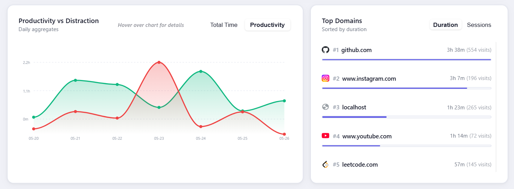
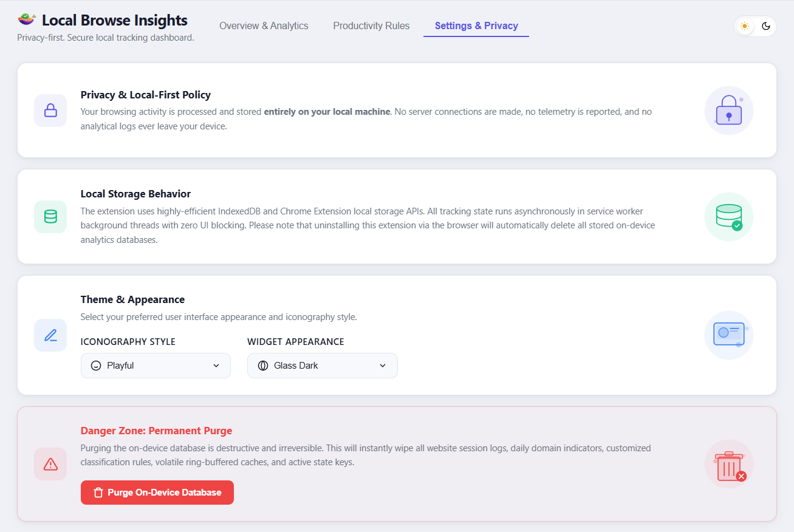
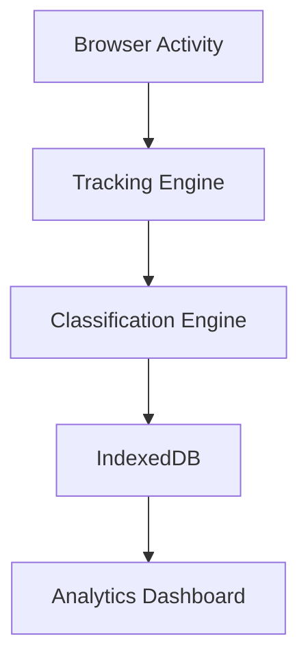

<div align="center">
  
  
  # Local Browse Insights
  
  **Privacy-First Browser Analytics Extension**
  
  Track your browsing habits, productivity score, focus hours, and time usage entirely on-device.
  
  No accounts. No cloud. No telemetry. No tracking.
  
  [Install](#-quick-install) • [Demo](#demo) • [Documentation](#%EF%B8%8F-developer-installation)
  
  <br />
  
  <p>
    <a href="https://github.com/Deekshith-goud/local-web-analytics-extension/actions/workflows/main.yml"></a>
    <a href="https://github.com/Deekshith-goud/local-web-analytics-extension/releases"></a>
    <a href="https://github.com/Deekshith-goud/local-web-analytics-extension/issues"></a>
    <a href="https://github.com/Deekshith-goud/local-web-analytics-extension/stargazers"></a>
    
    
    
  </p>
</div>

---

## Demo


---

## Screenshots

### Dashboard


### Analytics


### Floating Widget


### Settings & Privacy


---

## Features

**📊 Local Analytics Dashboard**  
Visualize browsing behavior without external services.

**🎯 Productivity Scoring**  
Automatically classify productive and distracting websites.

**⏱ Focus Hour Tracking**  
Monitor deep work sessions.

**🔒 Privacy First**  
Zero telemetry and zero external requests.

**🧹 One-Click Data Purge**  
Delete all stored data instantly.

---

## ⚡ Quick Install

1. Download the [latest release](https://github.com/Deekshith-goud/local-web-analytics-extension/releases).
2. Open Google Chrome and navigate to `chrome://extensions/`.
3. Enable **Developer mode** in the top-right corner.
4. Click **Load unpacked**.
5. Select the extracted extension folder.

---

## 🛠️ Developer Installation

### Prerequisites
- **[Bun](https://bun.sh/)** (v1.0+)
- **[Node.js](https://nodejs.org/)** (v18+)
- **Git**

### Setup Steps
1. **Clone the repository**
   ```bash
   git clone https://github.com/Deekshith-goud/local-web-analytics-extension.git
   cd local-web-analytics-extension
   ```

2. **Install dependencies**
   ```bash
   bun install
   ```

3. **Start the development server**
   ```bash
   bun run dev
   ```

4. **Load the Extension in Chrome**
   - Go to `chrome://extensions/`
   - Enable **Developer mode**
   - Click **Load unpacked**
   - Select `build/chrome-mv3-dev`

*(For production builds, run `bun run build`. To run security audits and package, use `bun run package`.)*

---

## 🏗 Architecture



---

## 🛡️ Privacy Guarantees

We believe your browsing history is deeply personal. **Local Browse Insights** adheres to the following strict privacy guarantees:

1. **Zero Remote Processing**: No accounts are required. No cloud backups, no AI profiling, and no server-side rendering. Everything runs in your browser's sandboxed Service Worker.
2. **Zero Telemetry**: We do not use Google Analytics, tracking pixels, crash reporters, or any other external monitoring tools. 
3. **No External Connections**: The extension's `manifest.json` deliberately omits `host_permissions` outside of local execution, meaning the extension literally *cannot* make network requests to external servers.
4. **Data Ownership**: You have complete control over your data. A built-in "Danger Zone" allows you to permanently and securely purge all IndexedDB records, local storage caches, and configurations with a multi-step confirmation.

---

## 🔒 Security Architecture

This extension was engineered over 10 rigorous phases with a focus on defense-in-depth:
- **Deny-by-Default Gateway**: All internal messaging passes through a strict context-aware capability validator.
- **XSS Mitigation**: Content scripts operate in isolated worlds. We never use `eval()`, `new Function()`, or unsafe inline scripts.
- **Automated Security Pipelines**: Custom CI scripts audit manifest permissions, CSP directives, and dangerous APIs on every build to prevent accidental permission creep.

---

## 🗺 Roadmap

- [x] Productivity Tracking
- [x] Analytics Dashboard
- [x] Focus Hour Tracking
- [x] Privacy Controls

### Planned
- [ ] Firefox Support
- [ ] Weekly Reports
- [ ] CSV Export
- [ ] Custom Classification Rules
- [ ] Trend Analytics

---

## 🤝 Contributing

Open source contributions are warmly welcomed and greatly appreciated! 

1. **Fork the Project**
2. **Create your Feature Branch** (`git checkout -b feature/AmazingFeature`)
3. **Commit your Changes** (`git commit -m 'feat: add AmazingFeature'`)
4. **Push to the Branch** (`git push origin feature/AmazingFeature`)
5. **Open a Pull Request**

*Please ensure your code passes linting (`bun run lint`) and type checks (`bun x tsc --noEmit`). No PRs adding telemetry or remote API calls will be accepted.*

---

## 📄 License

Distributed under the MIT License. See `LICENSE` for more information.
