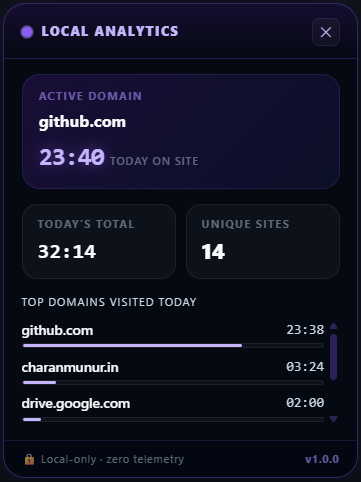

<div align="center">
  
</div>

<p align="center">
  <a href="https://github.com/Deekshith-goud/local-web-analytics-extension/actions/workflows/main.yml"></a>
  <a href="LICENSE"></a>
  
  <br/>
  
  
  
  
</p>

**Local Browse Analytics** is a browser extension that tracks your browsing activity, time usage, and productivity score entirely on-device. Built for developers and privacy-conscious users, it ensures zero telemetry, zero external tracking, and requires no accounts. Everything stays local.

**Built With:** TypeScript, [Plasmo](https://docs.plasmo.com/), React, IndexedDB, TailwindCSS, and Recharts.

## Why Local Browse Analytics?

Most time-tracking tools send your browsing history to the cloud. We don't.

| Feature | Local Browse Analytics | Typical Analytics Tools |
|---------|------------------------|-------------------------|
| **Data Storage** | 100% Local (IndexedDB) | Cloud servers / External syncing |
| **Telemetry** | Zero | Extensive tracking |
| **Accounts Required** | None | Mandatory login |
| **Privacy Risk** | None (Runs offline) | High (Data sent externally) |

## Installation

### 🚀 For General Users (Recommended)

1. Download the `.zip` from the **[Latest Release →](https://github.com/Deekshith-goud/local-web-analytics-extension/releases)**
2. Go to `chrome://extensions/`, enable **Developer mode**, and select **Load unpacked** on the extracted folder.

### 🛠 For Developers

```bash
git clone https://github.com/Deekshith-goud/local-web-analytics-extension.git
cd local-web-analytics-extension
bun install
bun run dev  # For active development
bun run build # For a production-optimized build
```

Then load the generated `build/chrome-mv3-dev` (or `prod`) directory as an unpacked extension in Chrome.

## Quick Start

Once installed, simply browse the web as usual. Click the floating widget on any page or click the extension icon in your browser toolbar to view your local analytics.


## Application Gallery

<div align="center">
  
  
</div>

**[📂 Browse all screenshots in the assets folder](assets/)**
 
## Data Transparency & Schema

**Local Browse Analytics** stores its data entirely inside your browser's IndexedDB.

### What is stored?
* **Domain Names**: Only root domains (e.g., `github.com`) are stored. **Full URLs, query parameters, and specific paths are stripped and NEVER saved.**
* **Timestamps & Durations**: The start time and duration of your active tab sessions.

### Data Retention & Portability
* **Retention Controls**: Configure the extension to automatically purge raw activity data older than a specified timeframe (e.g., 30, 60, or 90 days) directly from Settings.
* **Export/Import**: Full control of your data. Export analytics into CSV, JSON, or a visual PDF report locally.

## Auditability & Manual Verification

Verify the "no remote requests" and "local-only" claims yourself using Chrome Developer Tools:

1. **Verify Local Storage**: Open the extension dashboard, press `F12`, navigate to the **Application** tab, and expand **IndexedDB**. You will see the `LocalBrowseAnalyticsDB`.
2. **Verify Network Activity**: In DevTools, navigate to the **Network** tab, and browse. You will see **zero** external tracking requests.

## Configuration Reference

<details>
<summary><strong>Click to view all configuration options</strong></summary>

Configure tracking and privacy preferences in the settings panel:

| Option | Default | Description |
|---|---|---|
| **Tracking Level** | `Domains Only` | Tracks root domains (e.g. `github.com`). Full URLs are never saved. |
| **Productivity Scoring** | `Enabled` | Automatically categorizes visited websites as productive or distracting. |
| **Floating Widget** | `Enabled` | Displays a minimal, non-intrusive floating tracker on active web pages. |
| **Data Purge** | `-` | Instantly and permanently wipe all local IndexedDB data. |

</details>

## Features & Architecture

Built as a robust, offline-first analytics engine directly in your browser:

* **Active Tracking Engine**: Monitors browsing time only when the window is focused, the tab is active, and you are not idle.
* **Productivity Classification**: Automatically scores websites to provide daily, weekly, and monthly productivity insights.
* **Floating Widget**: A non-intrusive, isolated Shadow DOM widget displaying current session stats natively.
* **Full Analytics Dashboard**: Deep insights, activity heatmaps, session timelines, and top domains through an interactive popup UI and full-page dashboard.
* **Zero Overhead**: Minimizes CPU/RAM usage by batching IndexedDB writes and debouncing UI updates.

## Roadmap & Status

**Status: v1.0 Released.** The core tracking engine, dashboard, and offline database are fully operational.  
*Future feature planning (v1.1+) is actively tracked in our [GitHub Issues](https://github.com/Deekshith-goud/local-web-analytics-extension/issues).*

## FAQ & Troubleshooting

<details>
<summary><strong>The extension isn't tracking my time — what's wrong?</strong></summary>

The tracker only runs when **all three** conditions are met:
- The browser window is focused
- The tab is active (not in the background)
- You are not idle
</details>

<details>
<summary><strong>Does this work on Edge, Brave, or other browsers?</strong></summary>

Yes. Any **Chromium-based browser** (Chrome, Edge, Brave, Arc, Opera) supports Manifest V3 extensions via "Load unpacked".
</details>

<details>
<summary><strong>How do I back up or export my data?</strong></summary>

All data is stored in your browser's **IndexedDB**. A one-click CSV export is planned for v1.1.
</details>

<details>
<summary><strong>Will this slow down my browser?</strong></summary>

No. The engine batches all IndexedDB writes and debounces UI updates to minimize CPU and RAM usage.
</details>

## Contributing

We warmly welcome open-source contributions! Please follow these rules:

1. **The Golden Rule (Privacy First)**: No telemetry, external network requests, remote scripts, or exfiltration of user data will be accepted. Processing must remain **100% on-device**.
2. **Open an Issue First**: Discuss proposed changes before submitting a PR.
3. **Commit Standards**: Use [Conventional Commits](https://www.conventionalcommits.org/).
4. **Testing & Linting**: Run `bun run lint` and `bun x tsc --noEmit` before pushing.

See our full [Contributing Guide](CONTRIBUTING.md).

## License

[MIT License](LICENSE)
