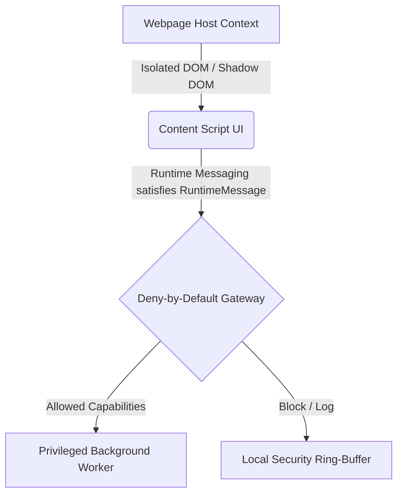

# Security Hardening & Permissions Audit

This document details the Manifest V3 privilege structure, strict Content Security Policies (CSP), and runtime isolation boundaries built into the **Web-Swap Tracker** browser extension.

---

## 1. Permissions Inventory (Least Privilege Compliance)

To guarantee the user's data privacy and security, this extension implements a strict deny-by-default permission profile. No wildcards or open scopes are requested.

| Permission | Context of Usage | Rationale & Privacy Guarantee | Alternate Designs Evaluated |
| :--- | :--- | :--- | :--- |
| **`storage`** | Background & Popup & Content | Required to persist the user's local custom productivity rules and Blob UI coordinates. **Guarantee**: Uses local browser storage ONLY; zero synchronization or remote telemetry. | Evaluated SQLite/FileSystem API: rejected due to unnecessary sandbox escape vectors. |
| **`tabs`** | Background Service Worker | Used strictly in tracking tab change transitions to capture precise active sessions (e.g. `chrome.tabs.onActivated`). **Guarantee**: Never tracks page HTML content, input values, or cookie hashes. | Evaluated activeTab: rejected because background tracking must function continuously. |
| **`activeTab`** | Dynamic Actions | Granted dynamically on user action to interact with active pages safely. | None. Standard Chrome mechanism for contextual access. |

---

## 2. Strict Content Security Policy (CSP)

The extension employs a rigid Content Security Policy strictly aligned with the highest Chrome Web Store security standards.

```json
"content_security_policy": {
  "extension_pages": "default-src 'self'; script-src 'self'; object-src 'none';"
}
```

### Security Hardening Measures
1. **No External Scripts (`script-src 'self'`)**:
   - Strictly forbids the execution of scripts loaded from remote CDNs, third-party trackers, or servers.
   - Prevents Man-in-the-Middle (MitM) script injection vectors.
2. **No Dynamic Execution (`unsafe-eval` banned)**:
   - Evaluators like `eval()`, `setTimeout(string)`, and `new Function()` are completely blocked.
   - Prevents DOM-based cross-site scripting (XSS) via string-to-code evaluation.
3. **No Unsafe Inline Styles (`style-src 'self'`)**:
   - Blocks dynamic inline style injection.
   - Prevents CSS injection attacks from spoofing the premium dashboard interface.

---

## 3. Strict Context Isolation Boundaries

The extension interacts across three distinct runtime zones:


### Content Script UI Isolation (`content.tsx`)
- **Shadow DOM Isolation**: The Floating Blob UI renders inside an isolated Shadow DOM container. This shields the extension's controls and style rules from context leaks or manipulation by malicious third-party script assets on the active webpage.
- **Protocol Verification**: Content scripts are strictly excluded from injecting inside sensitive domains (like bank sign-ins, payment gates, or identity portals) using regex match lists and configuration protocol checks.

### Background Message Gateway Defense (`background.ts`)
- **Origin derivation (`deriveSurface`)**: Validates the sender parameters on every message (`sender.id === chrome.runtime.id`). Context is classified using strict URL analysis (e.g. distinguishing `content` tab origins from privileged `popup.html` and `dashboard.html` paths).
- **Capability Mapping (`MESSAGE_CAPABILITIES`)**: Map that associates message action keys with allowed context surfaces. For example, webpage content scripts are restricted from performing mutations such as `SAVE_PRODUCTIVITY_RULES` or `TOGGLE_TRACKING` – attempts automatically trigger high-fidelity local security incident alerts.
- **Telemetry-Free Diagnostics (`RingBuffer`)**: All malformed structures, coordinates overruns, or spoofing vectors are recorded inside an on-device 50-entry chronologically organized Ring Buffer and atomic counter maps. Zero data is transmitted off the device.
